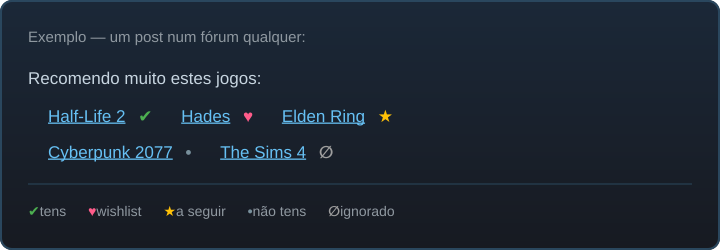

#  Steam Web Integrator

Userscript que marca automaticamente **links da Steam em qualquer página web** com um
pequeno emblema a indicar a tua relação com o jogo — sem precisares de abrir a loja.

## Emblemas

| Emblema | Significado |
|---------|-------------|
| ✔ (verde) | Já tens o jogo / pacote |
| ♥ (rosa) | Está na tua wishlist |
| ★ (amarelo) | Estás a seguir |
| ∅ (cinzento) | Marcaste como ignorado |
| • (cinzento azulado) | Não tens |
| ⇩ (roxo) | É DLC (e diz-te se tens o jogo base) |
| ☠ (branco) | Removido da loja Steam |
| ⚙ (ciano) | Funcionalidades de perfil limitadas |
| 🂡 (azul) | Tem cartas colecionáveis |
| 🎁 (amarelo) | Já esteve em bundles |

Funciona em fóruns, Reddit, sites de bundles, SteamDB, agregadores de promoções —
qualquer página com links para `store.steampowered.com`, `steamcommunity.com`,
`steamdb.info` ou `s.team`.

## Instalação

1. Instala o [Tampermonkey](https://www.tampermonkey.net/) (ou Violentmonkey).
2. **[➜ Clica aqui para instalar](https://github.com/fabioganga1/steam-web-integrator/raw/master/steam-web-integrator.user.js)**
   — o Tampermonkey abre a instalação automaticamente e mantém o script atualizado.
3. Inicia sessão na [Steam](https://store.steampowered.com/) no browser — é daí que
   o script obtém os teus dados (jogos, wishlist, ignorados, seguidos).

## Como funciona

- Os teus dados (jogos, wishlist…) vêm do endpoint `dynamicstore/userdata` da Steam e
  ficam em **cache local** (30 minutos) para não sobrecarregar nem atrasar as páginas.
- Os dados extra (DLC, removidos, cartas, bundles, perfis limitados) vêm de fontes
  públicas da comunidade — [Barter.vg](https://bartervg.com) e
  [Steam Tracker](https://steam-tracker.com) — com cache de **48 horas**.
- Um `MutationObserver` apanha conteúdo carregado dinamicamente (scroll infinito, SPAs).
- **Zero dependências**: JavaScript puro, sem jQuery nem bibliotecas externas.

## Menu do Tampermonkey

- **↻ Atualizar dados da Steam** — força refrescamento imediato da cache.
- **👁 Mostrar/esconder jogos que não tens** — esconde os pontos "não tens" para
  reduzir ruído visual (útil em páginas com centenas de links).
- **🧩 Ligar/desligar extras** — desativa os emblemas de DLC, removidos, cartas e
  bundles se só quiseres o essencial.
- **🧹 Limpar cache** — apaga todos os dados guardados localmente.

## Privacidade

Os teus dados **nunca saem do teu browser**. A lista de jogos, wishlist, ignorados e
seguidos vem da própria Steam (com a tua sessão) e fica em cache local no Tampermonkey.

Com os extras ligados, o script **descarrega** listas públicas do
[Barter.vg](https://bartervg.com) e do [Steam Tracker](https://steam-tracker.com) — catálogos
gerais de DLC, cartas, bundles e jogos removidos, iguais para toda a gente. São downloads:
não vai lá nenhum dado teu, nem sequer que jogos tens. Se preferires que o script só fale
com a Steam, desliga-os no menu do Tampermonkey.

Sem análises, sem tracking, sem servidores meus.
